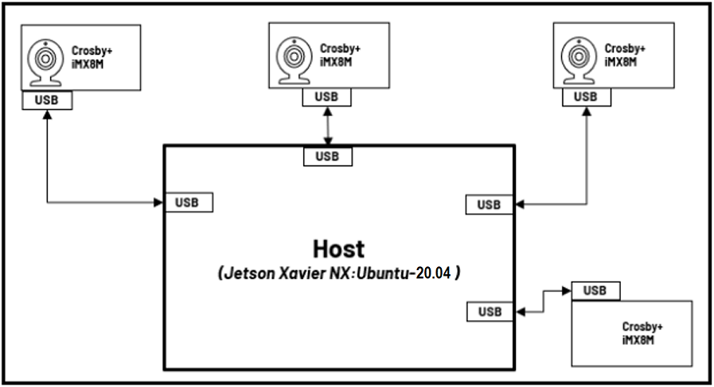
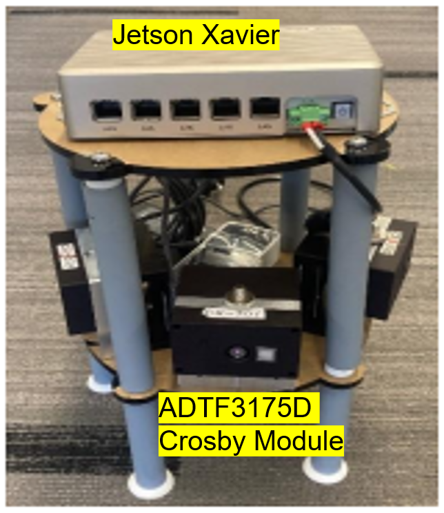
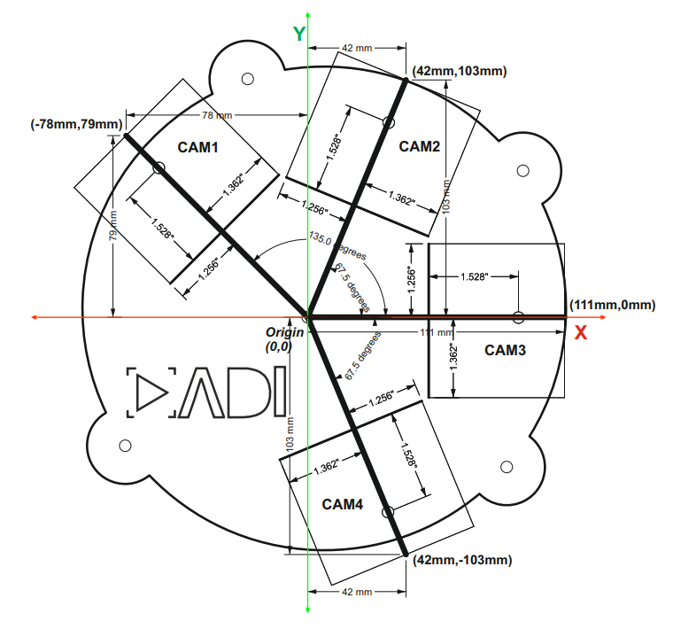
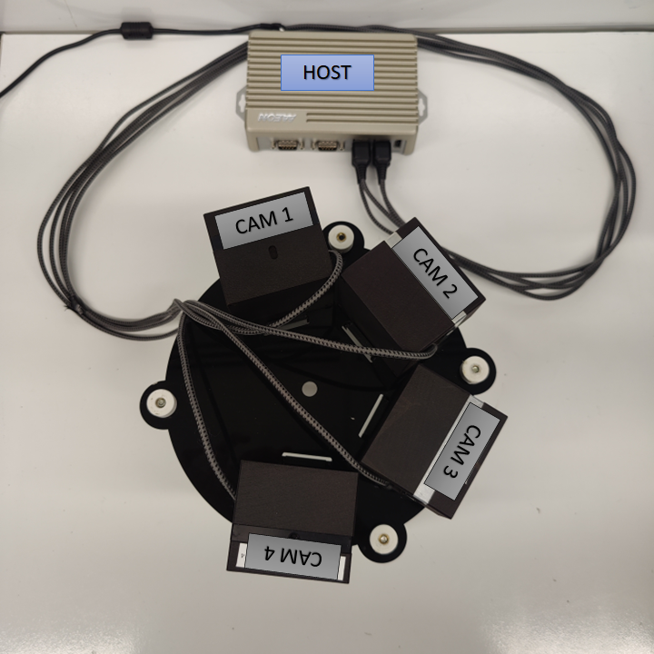

<h1 style="text-align: center;" > Analog Devices 3DToF Image Stitching</p>

---
# Overview
The **ADI 3DToF Image Stitching** is a ROS (Robot Operating System) package for stitching depth images from multiple Time-Of-Flight sensors like ADI’s ADTF3175D ToF sensor. This node subscribes to captured Depth and IR images from multiple **ADI 3DToF ADTF31xx** nodes, stitches them to create a single expanded field of view and publishes the stitched Depth, IR and PointCloud as ROS topics. The node publishes Stitched Depth and IR Images at 2048x512 (16 bits per image) resolution @ 10FPS in realtime mode on [AAEON BOXER-8250AI](https://www.aaeon.com/en/p/ai-edge-solutions-nvidia-jetson-xavier-nx-boxer-8250ai), while stitching inputs from 4 different [EVAL-ADTF3175D Sensor Modules](https://www.analog.com/en/design-center/evaluation-hardware-and-software/evaluation-boards-kits/EVAL-ADTF3175.html#eb-overview) and giving an expanded FOV of 278 Degrees. Along with the Stitched Depth and IR frames, the Stitched Point Cloud is also published at 10FPS.


[](https://docs.ros.org/en/humble/index.html) [](https://releases.ubuntu.com/jammy/) [](https://releases.ubuntu.com/focal/) [](./LICENSE)   

# Background
- Supported Time-of-flight boards: [ADTF3175D](https://www.analog.com/en/products/adtf3175.html)
- Supported ROS and OS distro: Humble (Ubuntu 22.04 and Ubuntu 20.04(Source Build))
- Supported platform: armV8 64-bit (arm64) and Intel Core x86_64(amd64) processors(Core i3, Core i5 and Core i7)

# Hardware

For the tested setup with GPU inference support, the following are used:
- 4 x [EVAL-ADTF3175D Modules](https://www.analog.com/en/design-center/evaluation-hardware-and-software/evaluation-boards-kits/EVAL-ADTF3175.html#eb-overview)
- 1 x [AAEON BOXER-8250AI](https://www.aaeon.com/en/p/ai-edge-solutions-nvidia-jetson-xavier-nx-boxer-8250ai)
- 1 x External 12V power supply
- 4 x Usb type-c to type-A cables - with 5gbps data speed support

Minimum requirements for a test setup on host laptop/computer CPU:
- 2 x [EVAL-ADTF3175D Modules](https://www.analog.com/en/design-center/evaluation-hardware-and-software/evaluation-boards-kits/EVAL-ADTF3175.html#eb-overview)
- Host laptop with intel i5 or higher cpu running Ubuntu-20.04LTS or WSL2 with Ubuntu-20.04
- 2 x USB type-c to type-A cables - with 5gbps data speed support
- USB power hub

> :memo: _Note: Refer the [User Guide](https://wiki.analog.com/resources/eval/user-guides/eval-adtf3175d-nxz) to ensure the eval module has adequate power supply during operation.

The image below shows the connection diagram of the setup (with labels):



The image below shows the actual setup used (for reference):



# Hardware setup
Follow the below mentioned steps to get the hardware setup ready:
1. Setup the ToF devices with [adi_3dtof_adtf31xx_sensor](https://github.com/analogdevicesinc/adi_3dtof_adtf31xx) node following the steps mentioned in the [repository](https://github.com/analogdevicesinc/adi_3dtof_adtf31xx/tree/humble-devel).
2. Ensure all devices are running at `10fps` by following these [steps](./docs/adtf_device_10_fps_setup.txt).
3. Position the cameras properly as per the dimentions shown in the below Diagram.



> :memo: _Notes_: 
> - Please contact the `Maintainers` to get the CAD design for the baseplate setup shown above. 

4. Finally, connect the devices to the host(Linux PC or AAEON BOXER-8250AI) using usb cables as shown below.



# Software

## Software Dependencies
Assumptions before building this package:
* Linux System or WSL2(Only Simulation Mode supported) running Ubuntu 22.04LTS
* ROS2 Humble: If not installed, follow these [steps](https://docs.ros.org/en/humble/Installation/Ubuntu-Install-Debians.html).
* Setup colcon workspace (with workspace folder named as "ros2_ws").
* System Date/Time is updated:
Make sure the Date/Time is set properly before compiling and running the application. Connecting to a WiFi network would make sure the Date/Time is set properly.
* NTP server is setup for device Synchronization. If not, please refer this [Link](https://ubuntuforums.org/showthread.php?t=862620) to setup NTP server on Host.

Software Requirements for Running on [AAEON BOXER-8250AI](https://www.aaeon.com/en/p/ai-edge-solutions-nvidia-jetson-xavier-nx-boxer-8250ai) :
* Nvidia Jetpack OS 5.0.2 .
* [CUDA 11.4](https://developer.nvidia.com/cuda-11-4-0-download-archive). It comes preinstalled with Jetpack OS. If not, follow these [steps](https://docs.nvidia.com/cuda/archive/11.4.0/cuda-installation-guide-linux/index.html).

# Clone

1. Clone the repo and checkout the correct release branch/
tag into ros2 workspace directory

    ```bash
    $ cd ~/ros2_ws/src
    $ git clone https://github.com/analogdevicesinc/adi_3dtof_image_stitching.git -b v2.0.0
    ```

# Build

Do proper exports first:
```bash
$ source /opt/ros/<ROS version>/setup.bash
```
Where:
- "ROS version" is the user's actual ROS version

Then:

For setup with GPU inference support using CUDA:
```bash
$ cd ~/ros2_ws/
$ colcon build --cmake-target clean
$ colcon build --symlink-install --cmake-args -DCMAKE_BUILD_TYPE=Release -DENABLE_GPU=True --event-handlers console_direct+
$ source install/setup.bash
```

For setup with CPU inference support using openMP:
```bash
$ cd ~/ros2_ws/
$ colcon build --cmake-target clean
$ colcon build --symlink-install --cmake-args -DCMAKE_BUILD_TYPE=Release --event-handlers console_direct+
$ source install/setup.bash
```
## Preparing the sensors

### Setting up the IP address
The default IP address of the sensor is set to `10.42.0.1`. It is essential that each sensor has its own IP to avoid conflicts. To do so, ssh into the sensor with the credentials:

> ```
> Username: analog
> Password: analog
> ```

1. Update the "Address" field in `/etc/systemd/network/20-wired-usb0.network` file.
2. Update the server address in `/etc/ntp.conf` (`server 10.4x.0.100 iburst`)
3. Reboot the device and login with the new ip

### Sharing the launch file
The sensor modules may be missing the required launch files that designate the transforms for the sensors in 3D space, which is essential the image stitching algorithm to work appropriately. to do so, we transfer the appropriate launch file, refer to the table below, to transfer to the corresponding sensor. Refer to the CAD diagram to determine the location and camera tag.
|Camera|Launch file|
|---|---|
|cam1|adi_3dtof_adtf31xx_cam1_launch.py|
|cam2|adi_3dtof_adtf31xx_cam2_launch.py|
|cam3|adi_3dtof_adtf31xx_cam3_launch.py|
|cam4|adi_3dtof_adtf31xx_cam4_launch.py|

To transfer the launch file
```bash
$ cd ~/ros2_ws/src/adi_3dtof_image_stitching/launch
$ scp adi_3dtof_adtf31xx_cam1.launch analog@10.42.0.1:/home/analog/ros2_ws/adi_3dtof_adtf31xx/launch
```
>- Ensure rmw settings are updated in all the Devices and the Host to support muti-sensor usecases
>>```bash
>> #Update the default rmw xml profile file to the settings file present inside "rmw_config" foler
>> $ export FASTRTPS_DEFAULT_PROFILES_FILE= ~/ros2_ws/src/adi_3dtof_image_stitching/rmw_config/rmw_settings.xml
>>#Next restart ROS daemon for the profile changes to take effect
>>$ ros2 daemon stop
>>```
> - The above mentioned steps for rmw settings setup can also be completed by running the "setup_rmw_settings.sh" script present inside the "rmw_config" folder.
>>```bash
>>$ cd ~/ros2_ws/src/adi_3dtof_image_stitching/rmw_config
>>$ chmod +x setup_rmw_settings.sh
>>$ source setup_rmw_settings.sh
>>```
# Nodes

## adi_3dtof_image_stitching_node

> :memo: _Note: For those with <cam_name> in the topic names, these are ideally the names assigned for EVAL-ADTF3175D camera modules. For example, if there are 2 cameras used, with the names as cam1 and cam2 ,there should be two subscribed topics for depth_image, specifically /cam1/depth_image for camra 1 and then /cam2/depth_image for camera 2._

### Published topics

These are the default topic names, topic names can be modified as a ROS parameter.

+ **/adi_3dtof_image_stitching/depth_image**
    - Stitched 16-bit output Depth image of size 2048X512 

+ **/adi_3dtof_image_stitching/ir_image**
    - Stitched 16-bit output IR image of size 2048X512

+ **/adi_3dtof_image_stitching/point_cloud**
    - Point cloud 3D model of the stitched environment of size 2048X512X3

### Subscriber topics

+ **/<cam_name>/ir_image** 
    - 512X512 16-bit IR image from sensor node  
+ **/<cam_name>/depth_image** 
    - 512X512 16-bit Depth image from sensor node  
+ **/<cam_name>/camera_info** 
    - Camera information of the sensor

### Parameters

> :memo: _Notes:_
> - _If any of these parameters are not set/declared, default values will be used._

##### _adi_3dtof_image_stitching ROS Node Parameters_

+ **param_camera_prefixes** (vector<string>, default: ["cam1","cam2","cam3","cam4"])
    - This list indicates the camera names of sensors connected for image stitching.
    - we support 2 sensors in minimum and 4 sensors at maximum for a horizontal setup at the moment.
    - The camera names must match the camera name assigned in the adi_3dtof_adtf31xx sensor node for the respective sensors.
+ **param_camera_link** (String, default: "adi_camera_link")
    - Name of camera Link
+ **param_enable_depth_ir_compression** (Bool, default: True)
    - Indicates if Depth compression is enabled for the inputs comming in from the adi_3dtof_adtf31xx sensor nodes
    - set this to "False" if Depth compression is disabled
+ **param_output_mode** (int, default: 0)
    - Enables/disables saving of stitched output.
    - set this to 1 to enable video output saving.
> :memo: _Notes:_Enabling video output slows down the speed of image stitching algorithm.
+ **param_out_file_name** (String, default: "stitched_output.avi")
    - output location to save stitched output if "param_output_mode" is enabled.

# Launch

### Simulation Mode

To do a quick test of image Stitching Algorithm, there is a simulation FILEIO setup that you can run.
Idea is, 4 adi_3dtof_adtf31xx sensor nodes will run in FILEIO mode on recorded vectors, publising sensor Depth and IR data which will be subscribed and processed by adi_3dtof_image_stitching node:
1. adi_3dtof_adtf31xx reads the binary recorded files and publishes depth_image ir_image and camera_info
2. The adi_3dtof_image_stitching node subscribes to the incoming data and runs image stitching algorithm on them.
3. It then publishes stitched Depth and IR images, along with stitched Point-cloud.

> :memo: _Notes_: 
> - Running the adi_3dtof_image_stitching node in Simulation mode requires the setup of [adi_3dtof_adtf31xx_sensor](https://github.com/analogdevicesinc/adi_3dtof_adtf31xx) node to be done before hand.  
> - It is assumed that both adi_3dtof_image_stitching node and adi_3dtof_adtf31xx node are built in the location "~/ros2_ws/".
> - It is also assumed that the demo vectors folder "adi_3dtof_input_video_files" is copied to the location "~/ros2_ws/src/". (please refer the "arg_in_file_name" in the launch files)

To proceed with the test, execute these following command:

| Terminal |
--- |
| <pre>$cd ~/ros2_ws/ <br>$source /opt/ros/humble/setup.bash <br>$source install/setup.bash <br>$ros2 launch adi_3dtof_image_stitching adi_3dtof_image_stitching_launch.py |

#### Monitor the Output on Rviz2 Window

1. Open a Rviz2 instance
2. in Rviz2 window add display for "/adi_3dtof_image_stitching/depth_image" to monitor the Stitched Depth output. 
3. Add display for "/adi_3dtof_image_stitching/ir_image" to monitor the Stitched IR output. 
4. Add display for "/adi_3dtof_image_stitching/point_cloud" to display the 3D point CLoud. 

### Real-Time Mode
To test the Stitching Algorithm on a real-time setup the adi_3dtof_image_stitching node needs to be launched in Host-Only mode
Idea is, the individual sensors connected to the host computer(Jetson NX host or Laptop) will publish their respective Depth and IR data independently in real-time:
1. Sensors will publish their respective Depth and IR frames of size 512X512 independently
2. The adi_3dtof_image_stitching node will subscribe to the incomming data from all sensors, synchronize them and run image stitching.
3. The stitched output is then published as ROS messages which can be viewed on the Rviz2 window.
4. Stitched output can also be saved into a video file by enabling the "enable_video_out" parameter.

To proceed with the test, first execute these following commands on four (4) different terminals (in sequence) to start image capture in the EVAL-ADTF3175D Modules:
:memo:
>- This is assuming that we are testing a 4-camera setup to get a 278 degrees FOV. Reduce the number of terminals accordingly for 2 or 3 camera setup.
>- Please ensure the below mentioned launch files are available inside the launch folder for the adi_3dtof_adtf31xx code present inside the devices. If not please follow the following steps:-
>> 1. Copy the respective launch files from the launch folder of the adi_3dtof_image_stitching repository to the launch folder of the adi_3dtof_adtf31xx code inside the devices.
>> 2. Change the 'arg_input_sensor_mode' paameter value to 0 to help run the node in real-time capture mode.
>> 3. Build the adi_3dtof_adtf31xx node again on the device, so it can access these new launch files.   

| Terminal 1 | Terminal 2  | Terminal 3| Terminal 4|
--- | --- | ---| --|
|<pre>~$ ssh analog@[ip of cam1] <br>>cd ~/ros2_ws/ <br>>source /opt/ros/humble/install/setup.bash <br>>source install/setup.bash <br>>ros2 launch adi_3dtof_adtf31xx adi_3dtof_adtf31xx_cam1_launch.py | <pre>~$ ssh analog@[ip of cam2] <br>>cd ~/ros2_ws/ <br>>source /opt/ros/humble/install/setup.bash <br>>source install/setup.bash <br>>ros2 launch adi_3dtof_adtf31xx adi_3dtof_adtf31xx_cam2_launch.py | <pre>~$ ssh analog@[ip of cam3] <br>>cd ~/ros2_ws/ <br>>source /opt/ros/humble/install/setup.bash <br>>source install/setup.bash <br>>ros2 launch adi_3dtof_adtf31xx adi_3dtof_adtf31xx_cam3_launch.py | <pre>~$ ssh analog@[ip of cam4] <br>>cd ~/ros2_ws/ <br>>source /opt/ros/humble/install/setup.bash <br>>source install/setup.bash <br>>ros2 launch adi_3dtof_adtf31xx adi_3dtof_adtf31xx_cam4_launch.py |

> :memo: _Notes: 
>- Its assumed that the adi_3dtof_adtf31xx nodes are already built within the EVAL-ADTF3175D Modules. It is also assumed that adi_3dtof_adtf31xx node are built in the location "~/ros2_ws/" within the sensor modules.
>- It is assumed that the respective sensor launch files from the adi_3dtfo_image_stitching package are copied to the launch folder of adi_3dtof_adtf31xx package within the respective sensors and the input mode is changed to 0.(it is 2 by default)_
>- The credentials to login to the devices is given below
>   ```
>   username: analog
>   password: analog
>   ```


Next run the adi_3dtof_image_stitching node on Host in the Host-Only mode, by executing the following command:
| Terminal 5 |
--- |
| <pre>$cd ~/ros2_ws/ <br>$source /opt/ros/humble/setup.bash <br>$source install/setup.bash <br>$ros2 launch adi_3dtof_image_stitching adi_3dtof_image_stitching_host_only_launch.py |

:memo: 
>- It is assumed that both adi_3dtof_image_stitching node is built in the location "~/ros2_ws/".
>- <span style="color:red">**Make sure that the Date/Time is correctly set for all the devices, this application makes use of the topic Timestamp for synchronization. Hence, if the time is not set properly the application will not run.**</span> 
>- If the Image Stitching Node is not subscribing/processing the depth and IR Data published by the connected sensors, please ensure the following points are checked:-
> 1. Ensure that the camera name prefixes for the sensor topics, match the names listed in **param_camera_prefixes** parameter of the image stitching launch file.
> 2. If the topics published by the sensors are uncompressed, please ensure to change the **param_enable_depth_ir_compression** parameter to **False** too in the launch file of Image Stitching Node.

**Monitor the Output on Rviz2 Window**

1. Open a Rviz2 Instance
2. in Rviz2 window add display for "/adi_3dtof_image_stitching/depth_image" to monitor the Stitched Depth output. 
3. Add display for "/adi_3dtof_image_stitching/ir_image" to monitor the Stitched IR output. 
4. Add display for "/adi_3dtof_image_stitching/point_cloud" to display the 3D point CLoud. 

# Limitations
1. Currently a maximum of 4 sensors and a minimum of 2 sensors are supported for stitching, in the horizontal setup proposed.
2. Real-time Operation is not currently supported on WSL2 setups.
3. [AAEON BOXER-8250AI](https://www.aaeon.com/en/p/ai-edge-solutions-nvidia-jetson-xavier-nx-boxer-8250ai) slows dows as the device heats up, hence proper cooling mechanism is necessary.
4. Subscribing to stitched point cloud for real-time display might slow down the algorithm operation.

# Known Issues
1. While using WSL2 on a Windows system to run the [simulation mode demo](#simulation-mode) the auto-spawned Rviz2 window may stop in some cases. In such instances please open Rviz2 again from a new terminal and subscribe to the necessary topics to continue. Steps are mentioned [here](#monitor-the-output-on-rviz2-window). 

# Support

Please contact the `Maintainers` if you want to evaluate the algorithm for your own setup/configuration.

Any other inquiries are also welcome.
